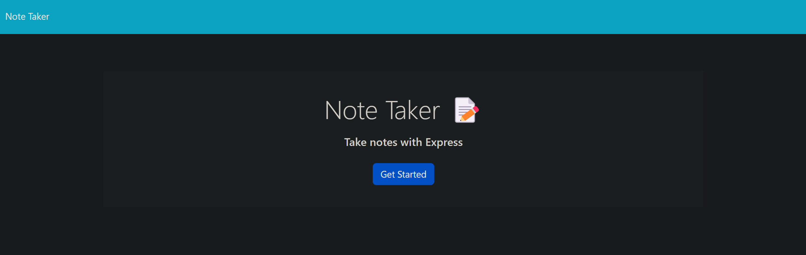
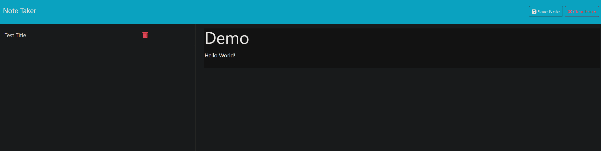

# noting-nexus
## Description
An easy to navigate web application that lets you review old notes, create new ones, and easily delete unecessary notes that you may not need anymore. I worked on this little project to challenge myself and begin to get familiar with utilizing render.com and express amongst other npm libraries.

## Installation
You can access the application through the deployed URL:
[noting-nexus](https://noting-nexus.onrender.com/)

## Usage
Upon clicking the "Get Started" button on the main page it will redirect you over to the notes page that stores old notes and is where you can save new ones. When you're writing a note you'll notice a save and clear function at the top right for easy intuitive use.

## Screenshot/Demo

## License
MIT License

## Questions
If you have any questions, please feel free to contact my email: 
[Email](mailto:mnaustinlee@gmail.com). 

You can also find more of my work at: 
[Kushonim](https://github.com/Kushonim).
